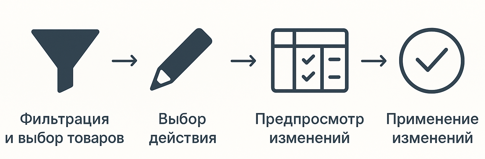

# Добро пожаловать в Bulk Products!

**Bulk Products** — это удобный и мощный инструмент для массового управления товарами в вашем интернет-магазине на OpenCart.

С помощью этого модуля вы сможете:

- быстро находить нужные группы товаров по разным параметрам;
- редактировать сразу десятки, сотни и даже тысячи товаров за несколько кликов;
- увидеть, какие именно изменения будут применены (предпросмотр);
- массово удалять товары;
- улучшать SEO ваших товаров вручную или с помощью искусственного интеллекта (AI).

---

## Для кого этот модуль

Модуль создан для владельцев интернет-магазинов, менеджеров и контент-редакторов.  
Вам не нужно быть программистом — интерфейс модуля интуитивно понятен, а подробные инструкции помогут быстро освоиться.

---

## Как работает модуль

Работа с модулем делится на несколько простых шагов:

1. **Фильтрация и выбор товаров** — вы выбираете, с какими товарами хотите работать, с помощью удобных фильтров.
2. **Выбор действия** — указываете, что нужно сделать с выбранными товарами. Например, изменить цену, название, категории, удалить товары или обновить SEO-атрибуты.
3. **Предпросмотр изменений** — перед применением вы увидите, как именно изменятся ваши товары, в наглядной таблице со старыми и новыми значениями.
4. **Применение изменений** — после проверки вы применяете изменения к товарам в магазине.

Каждый шаг подробно описан в этой документации.

---

## Поддержка и обновления

Я постоянно дорабатываю и улучшаю модуль. Каждый пользователь может предлагать идеи и влиять на развитие функционала.  
Если у вас возникли вопросы или сложности — не переживайте, поддержка всегда рядом.

В официальной группе Telegram я публикую анонсы новых версий, провожу опросы по функционалу и делюсь готовыми примерами фильтров.

- :simple-telegram: [Официальная группа в Telegram](https://t.me/ocstore3)
- :e-mail: **Техподдержка:** [mail@nikitakiselev.ru](mailto:mail@nikitakiselev.ru)