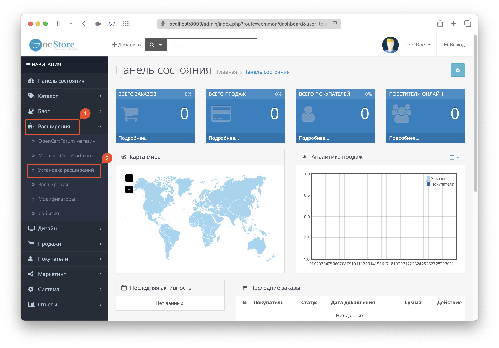
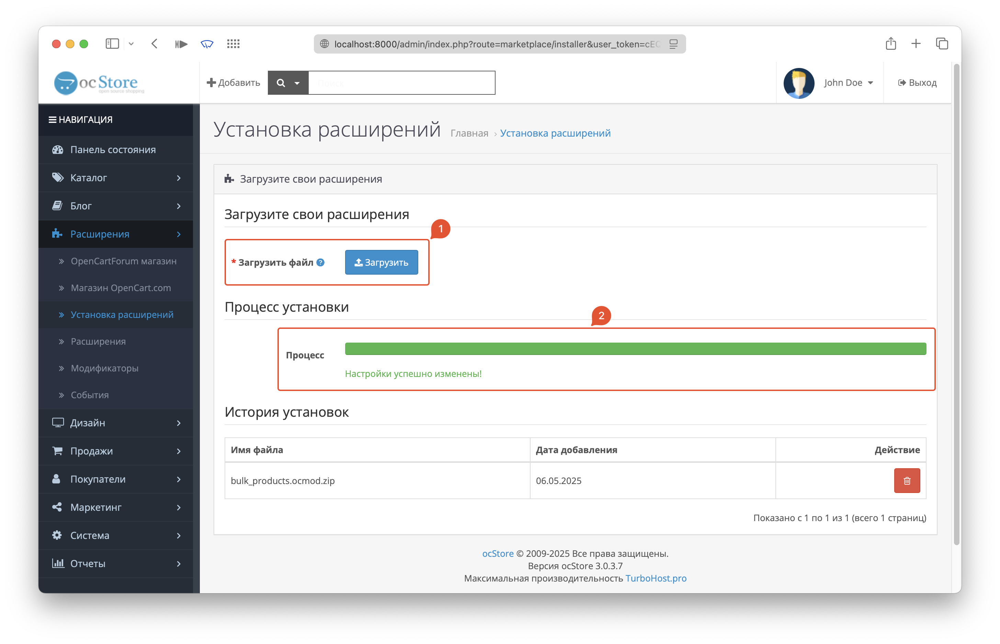
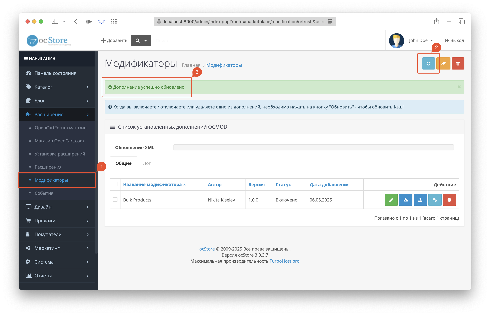
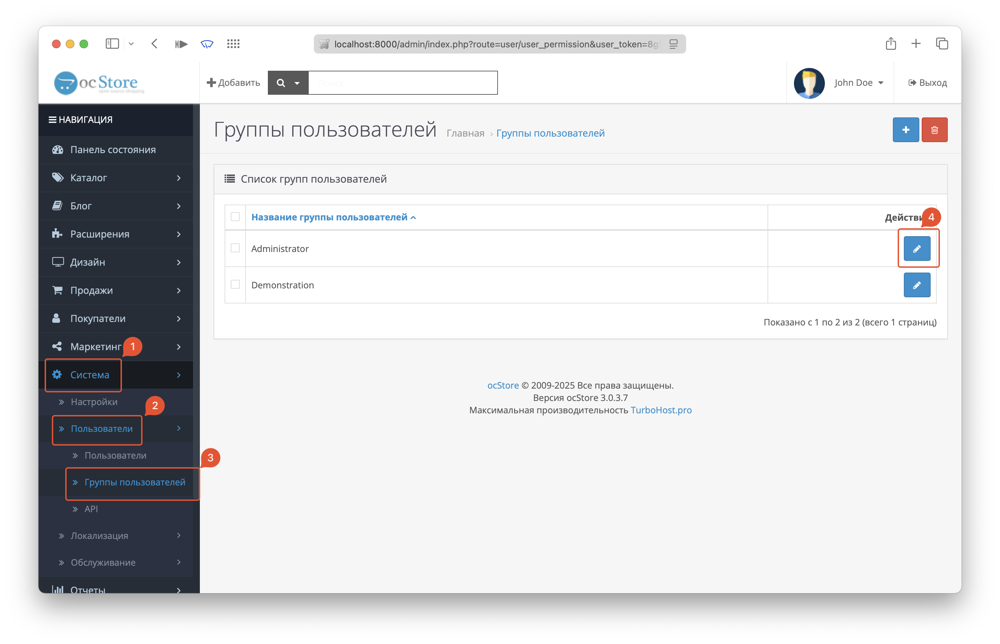
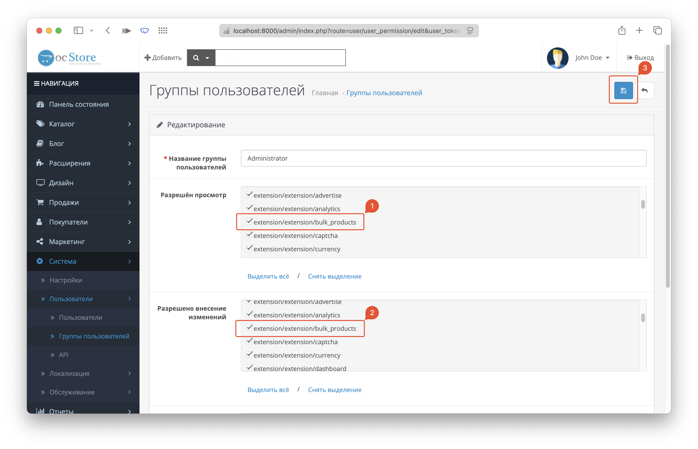
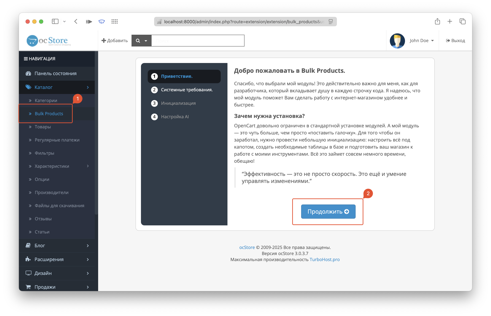
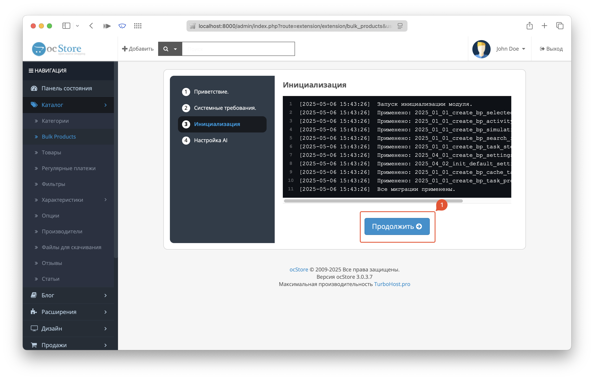
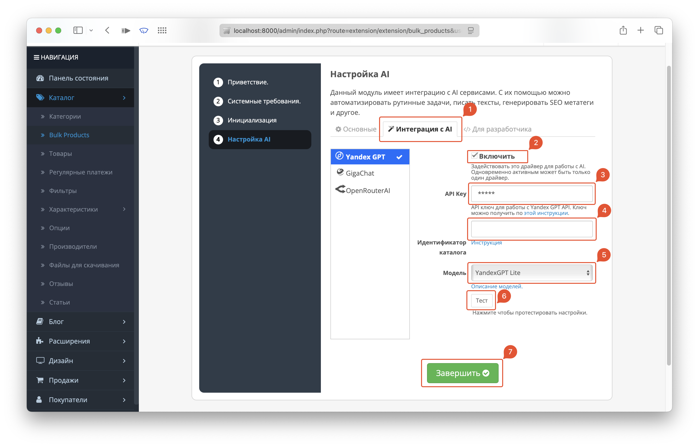
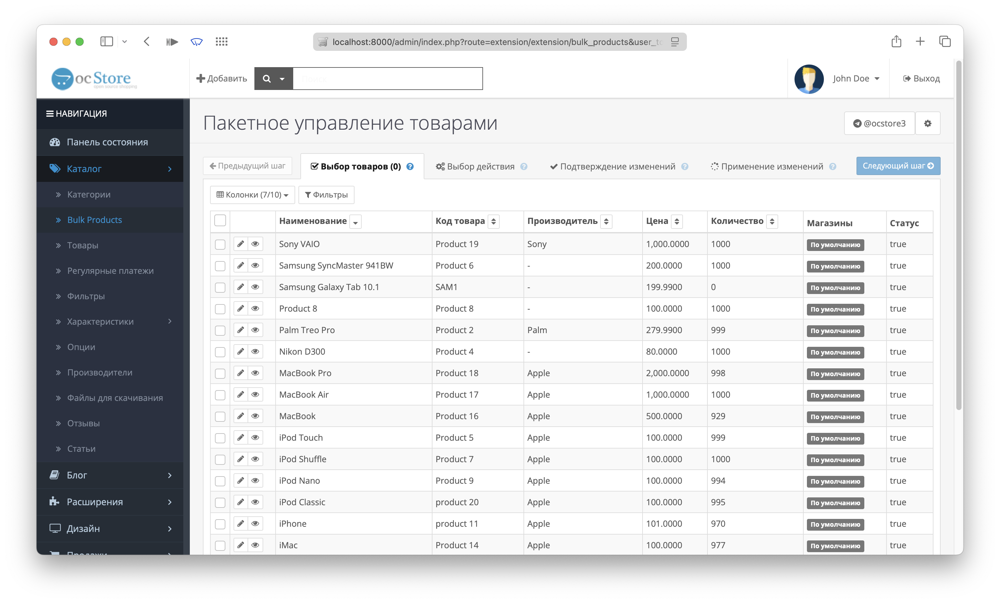

## Системные требования:

* OpenCart 3.\* (OcStore 3.\*)
* PHP 7.3+
* PHP расширения: `json`, `pdo`
* Настройка в php.ini: `max_execution_time = 60` (не менее 60 секунд)
* MySQL 5.7.8+ (MariaDB 10.2.3+)

## Установка модуля

Рекомендуемый способ установки модуля - через админ панель OpenCart.

### Скачать
Скачать архив с модулем `bulk_products.ocmod.zip`.
### Авторизация
Перейти в административную панель OpenCart (https://ваш-сайт/admin) и авторизоваться.

### Установка расширения
1. В боковом меню выбрать пункт **"Расширения -> Установка расширений"**. 
2. В поле **"Загрузить файл"** выбрать архив с модулем и дождаться окончания установки. 

### Обновить кеш
В боковом меню выбрать пункт **"Расширения -> Модификаторы"** и нажать на кнопку **"Обновить"**. 

### Установка прав на модуль
1. Перейти на страницу **"Система -> Пользователи -> Группы пользователей"** и отредактировать группу "Administrator". 
2. В полях **"Разрешён просмотр"** и **"Разрешено внесение изменений"** выставить права на модуль `extension/extension/bulk_products`, сохранить изменения. 

### Инициализация Bulk Products
1. Перейти на страницу **"Каталог -> Bulk Products"**, запустится мастер первой инициализации модуля. После ознакомления нажать **"Продолжить"**. 
2. На странице проверки системных требований, убедиться, что все пункты зелёные. Нажать **"Продолжить"**.

    !!! warning "Внимание!"
        Не гарантируется стабильная работа модуля, если хотя бы один из пунктов не удовлетворяет требованиям.

3. Далее, на этапе **"Инициализация"** будут созданы таблицы, необходимые для корректной работы модуля. Здесь не должно быть ошибок. Нажать **"Продолжить"**. 
4. На шаге "Настройка AI" опционально можно заранее настроить параметры работы модуля и компонентов AI. Подробно про настройку модуля и AI функций описано на странице [Настройки](settings.md)
    Настраивать сейчас не обязательно, можно настроить позже. Нажать **"Завершить"**. 
5. **Установка и инициализация завершена!** После этого откроется главная страница модуля Bulk Products. 