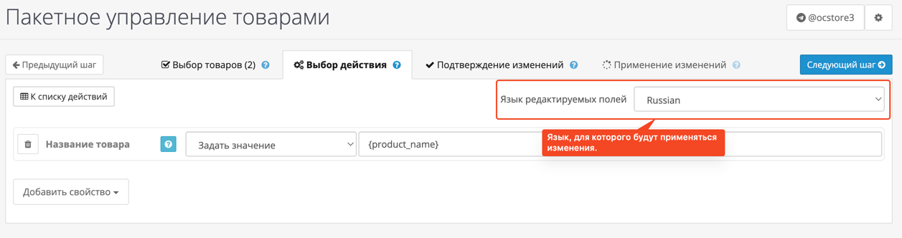

# Редактирование товаров

Модуль **Bulk Products** позволяет выполнять различные действия с выбранными товарами.  
Всего доступно три вида действий:

1. **Редактирование свойств товаров вручную**
2. **Удаление выбранных товаров**
3. **SEO Master** — инструмент для гибкого редактирования SEO-атрибутов

На этой странице описывается первое действие — **массовое редактирование свойств товаров вручную**.

{width=80%}
/// caption
Внешний вид инструмента «Редактирование свойств товаров».
///

---

## Что можно редактировать

В данный момент поддерживается редактирование следующих свойств:

- [Название товара](product_name.md)
- [Цена](product_price.md)
- [Производитель](product_manufacturer.md)
- Категории
- Главная категория
- Описание
- HTML Tag H1
- Meta Tag Title
- Meta Tag Description
- Meta Tag Keywords
- Код товара
- Количество
- Статус товара (включён / выключен)
- Скидки

Вы можете выбрать одно или несколько свойств, которые нужно изменить.  
Каждое свойство добавляется в виде отдельного блока с параметрами редактирования.

---

## Поддержка мультиязычности

Многие поля в OpenCart поддерживают **несколько языков** (например, название, описание, SEO-теги и т. д.).  
Поэтому перед редактированием таких свойств вы можете выбрать, **для какого языка** будут применяться изменения.

{width=70%}
/// caption
Селектор выбора языка, для которого будут применяться изменения.
///

Выбранный язык автоматически распространяется на все добавленные свойства, поддерживающие языковую версию.

!!! example "Пример"
    Если вы выберете язык «Русский», то при изменении наименования будет редактироваться именно **русская версия** названия товара.

---

## Как использовать

1. Выберите нужные товары на шаге **«Выбор товаров»**.
2. Перейдите на вкладку **«Выбор действия»**.
3. Выберите действие **«Редактировать свойства»**.
4. Добавьте одно или несколько свойств, которые вы хотите изменить.
5. При необходимости укажите язык для языкозависимых полей.
6. Нажмите **«Следующий шаг»**, чтобы перейти к предварительному просмотру изменений.