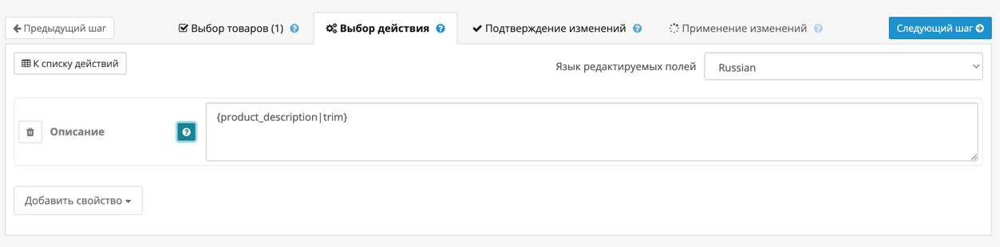

Инструмент **«Описание»** позволяет массово изменить текстовое описание у выбранных товаров.  
Это особенно удобно при генерации текстов, оптимизированных под SEO или при обновлении информации в большом количестве карточек.

{width=80%}
/// caption
Внешний вид инструмента редактирования описания
///

---

## Поддержка переменных

Вы можете использовать **переменные**, чтобы динамически подставлять значения из карточки товара.  
Это позволяет создавать уникальные описания для каждого товара автоматически.

Наиболее полезные переменные:

- `{product_name}` — название товара
- `{product_description}` — текущее описание товара
- `{product_manufacturer}` — производитель
- `{product_categories}` — список категорий через запятую
- `{product_model}` — модель товара

**Примеры:**

```
{product_name} — это продукт от {product_manufacturer}, который подходит для: {product_categories}.
```

→ *Кроссовки Sprint — это продукт от Nike, который подходит для: Спорт, Обувь*

```
Модель: {product_model}. Подробнее: {product_description}
```

→ *Модель: X500. Подробнее: Лёгкие и удобные кроссовки для бега…*

Полный список переменных доступен на странице [Переменные](variables.md).

---

## Поддержка модификаторов

Модификаторы позволяют изменять текст, полученный через переменные — удалять HTML, обрезать, менять регистр и многое другое.

**Популярные модификаторы**

- `trim` — удаляет пробелы в начале и в конце строки
- `remove_tags` — убирает HTML-теги и HTML-мнемоники
- `truncate:N` — обрезает строку до N символов
- `truncate_words:N` — обрезает до N слов
- `replace:что->на_что` — заменяет фрагмент строки
- `lower`, `upper` — приводит текст к нижнему/верхнему регистру
- `ucfirst`, `ucwords`, `capitalize` — работают с заглавными буквами
- `slugify`, `snake_case`, `kebab_case` — форматируют строку для URL
- `strip_digits`, `only_digits` — управляют цифрами в тексте
- `remove_vowels`, `reverse` — вспомогательные трансформации

**Примеры:**

```
{product_description|truncate:120}
```

→ *Обрежет описание до 120 символов с многоточием.*

```
{product_description|remove_tags}
```

→ *Удалит HTML: "Акция" &amp; скидка" → "Акция скидка"*

```
{product_name|upper} — {product_model}
```

→ *КРОССОВКИ SPRINT — X500*

```
{product_name|replace:2023->2024}
```

→ *Обновит год: "Модель 2023" → "Модель 2024"*

Полный список доступен на странице [Модификаторы](modificators.md).

---

Этот инструмент идеально подходит для генерации шаблонных описаний, автоматизации SEO или быстрого обновления информации без необходимости открывать карточку каждого товара вручную.

---

## Поддержка языков

Поскольку описание товара в OpenCart может быть указано на нескольких языках, инструмент позволяет выбрать язык, для которого будет выполнено редактирование.  
Выбранный язык применяется ко всем описаниям, которые вы задаёте в рамках этого действия.

!!! note
    Если у товара нет описания на выбранном языке — будет создано новое. Если описание уже существует — оно будет обновлено.