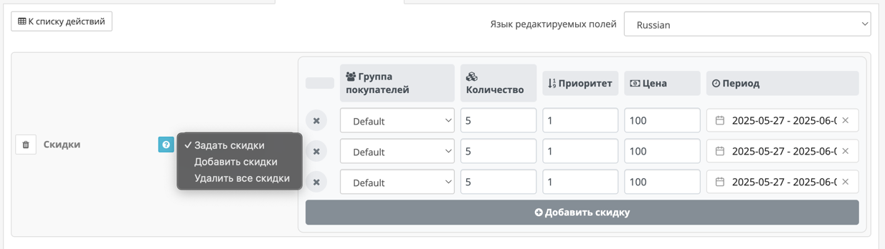

Инструмент **«Скидки»** позволяет массово управлять скидками у выбранных товаров.

Вы можете:

- **Задать новые скидки** — полностью заменить текущие скидки указанными.
- **Добавить скидки** — добавить указанные скидки к существующим.
- **Удалить все скидки** — полностью очистить список скидок у товаров.

---

## Поля скидки

Каждая скидка состоит из следующих параметров:

- **Клиентская группа** — группа покупателей, для которой действует скидка.
- **Количество** — минимальное количество товара, при котором применяется скидка.
- **Приоритет** — порядок применения (чем ниже число — тем выше приоритет).
- **Цена** — значение скидочной цены.
- **Дата начала** — с какой даты действует скидка.
- **Дата окончания** — до какой даты действует скидка.

Вы можете указать одну или несколько скидок, которые будут применены ко всем выбранным товарам в зависимости от выбранного действия.

---

## Режимы работы

### Задать значение

Полностью заменяет все текущие скидки на указанные.  
Если у товара были свои скидки — они будут удалены.

### Добавить значение

Добавляет указанные скидки к существующим.  
Если у товара уже есть аналогичная скидка (та же группа и количество) — новая не заменит её, а будет добавлена как отдельная строка.

### Удалить значение

Удаляет **все скидки** у выбранных товаров.  
Это действие полезно, если вы хотите очистить скидки перед новым импортом или обновлением условий.

!!! warning "Внимание"
    При использовании режима «Задать значение» или «Удалить значение» все существующие скидки будут **удалены** и не подлежат восстановлению.

---

Этот инструмент позволяет гибко управлять скидками без необходимости вручную открывать каждую карточку товара.
