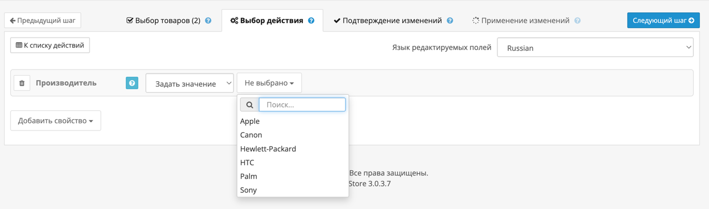

Инструмент **«Производитель»** позволяет массово изменить производителя у выбранных товаров.

{width=80%}
/// caption
Внешний вид инструмента редактирования производителя
///

Вы можете выполнить одно из двух действий:

1. **Задать значение** — установить нового производителя, выбрав его из выпадающего списка.
2. **Удалить значение** — полностью удалить информацию о производителе у всех выбранных товаров.

---

## Задать значение

При выборе этой опции вы можете указать производителя из существующего списка.  
Выбранный производитель будет установлен для всех отмеченных товаров — вне зависимости от того, кто был указан ранее.

!!! example
    Если вы выберете производителя «Apple», то все выбранные товары получат значение производителя «Apple».

---

## Удалить значение

При выборе этой опции текущий производитель будет удалён у всех выбранных товаров.  
Это может быть полезно, если вы хотите очистить поле производителя перед повторной массовой установкой или импортом.

!!! warning "Обратите внимание"
    Удаляется значение производителя независимо от того, какое оно было ранее. Это действие необратимо.

---

Инструмент позволяет быстро управлять производителями товаров без необходимости открывать каждую карточку вручную.
