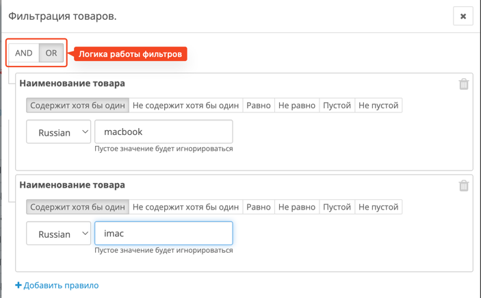
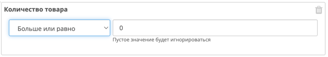
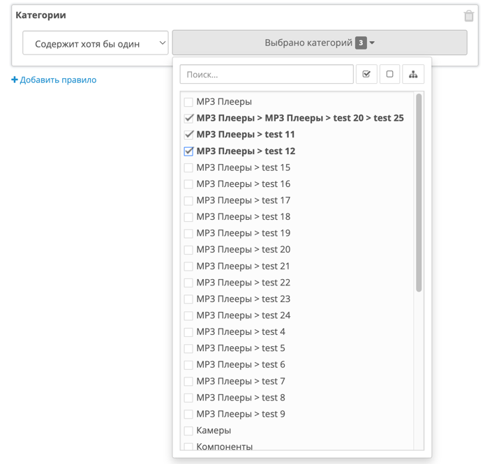
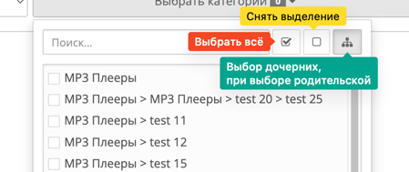
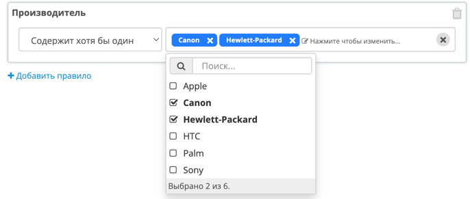
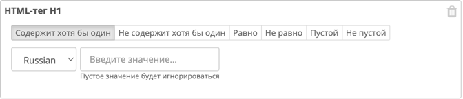
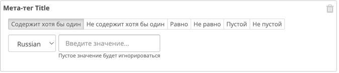
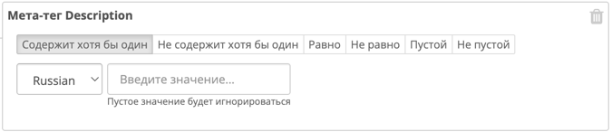
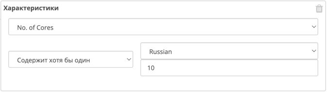

# Фильтры по товарам

Фильтры позволяют точно выбрать товары, с которыми необходимо провести пакетные действия.  
Они доступны на этапе **«Выбор товаров»**, после нажатия кнопки **«Фильтры»**.

Вы можете использовать **один** или **несколько фильтров одновременно**, комбинируя их для более точной выборки.  
У каждого фильтра есть собственные настройки и режимы работы, которые позволяют гибко настроить поиск.

Также вы можете задать **логику объединения фильтров** — выбрать, как именно будет применяться фильтрация:

{width=80%}
/// caption
Логика объединения фильтров: `И`, `ИЛИ`
///

- **Режим «И»** — в результат попадут **только те товары**, которые соответствуют **всем** выбранным фильтрам одновременно.
- **Режим «ИЛИ»** — в результат попадут **все товары**, которые соответствуют **хотя бы одному** из выбранных фильтров.

!!! tip "Когда использовать ИЛИ"
    Режим «ИЛИ» полезен, когда вы хотите объединить, например, товары из двух категорий или с разными производителями, без необходимости выполнять фильтрацию вручную по каждой группе.

---

## Доступные фильтры

На текущий момент модуль поддерживает следующие типы фильтрации:

- Наименование товара
- Цена товара
- Код товара
- Количество товара
- Категории
- Производитель
- HTML Tag H1
- Meta Tag Title
- Meta Tag Description
- Meta Tag Keywords
- Теги товара
- Описание
- Статус товара
- Характеристики

---

### Наименование товара

Позволяет фильтровать товары по их названию на выбранном языке.
Вы можете указать язык, по которому будет производиться поиск — например, только на русском или английском.

Доступные режимы:

- **Содержит** — название содержит введённое слово или фразу (регистр не важен).
- **Не содержит** — название *не* содержит заданного текста.
- **Равно** — полное совпадение с введённым названием.
- **Не равно** — исключает товары, название которых в точности совпадает с введённым.
- **Пусто** — отбираются товары, у которых отсутствует название на выбранном языке.
- **Не пусто** — отбираются товары, у которых указано хотя бы какое-то название.

---

### Цена товара

Позволяет фильтровать товары по их текущей цене.
Доступные режимы:

- **Между** — товар попадает в выборку, если его цена находится в указанном диапазоне (`от ... до ...`).
- **Равно** — точное совпадение с указанной ценой.
- **Больше** — цена товара строго больше указанного значения.
- **Больше или равно** — цена товара больше или равна введённому числу.
- **Меньше** — цена товара строго меньше указанного значения.
- **Меньше или равно** — цена товара меньше или равна введённому числу.
- **Не равно** — цена товара отличается от указанного значения.

!!! example "Пример"
    - Если вы хотите найти все товары дороже 1000 — используйте режим **Больше** и введите `1000`.
    - Если вы хотите исключить товары с ценой ровно 0 — используйте режим **Не равно** и значение `0`.

---

### Код товара

Позволяет фильтровать товары по **внутреннему коду (model)**, который указан в карточке товара.

> 🔤 Этот фильтр работает со строками, **без учёта языков**, так как код товара не имеет языковых версий.

Доступные режимы:

- **Содержит** — код содержит введённый фрагмент (без учёта регистра).
- **Не содержит** — код *не* содержит указанный текст.
- **Равно** — точное совпадение с введённым значением.
- **Не равно** — исключает товары, код которых совпадает с введённым.
- **Пусто** — отбираются товары без указанного кода.
- **Не пусто** — отбираются товары, у которых код задан.

Поле ввода позволяет указать любую строку или число для сравнения.

!!! tip "Пример использования"
    - Чтобы найти товары с кодом, начинающимся на `SKU-`, используйте режим **Содержит** и введите `SKU-`.
    - Чтобы найти товары, у которых код не указан — выберите режим **Пусто**.

---

### Количество товара

Позволяет фильтровать товары по количеству на складе (значение поля `quantity`).

{width=500}
/// caption
Вид фильтра по количеству товара
///

Доступные режимы:

- **Между** — отбирает товары, количество которых находится в указанном диапазоне (`от ... до ...`).
- **Равно** — точное совпадение с указанным значением.
- **Больше** — количество строго больше указанного числа.
- **Больше или равно** — количество больше или равно заданному значению.
- **Меньше** — количество строго меньше указанного числа.
- **Меньше или равно** — количество меньше или равно заданному значению.
- **Не равно** — количество отличается от введённого значения.

!!! example "Пример"
    - Чтобы найти товары с нулевым остатком — используйте режим **Равно** и значение `0`.
    - Чтобы найти товары, которых меньше 5 — используйте **Меньше** и значение `5`.

---

### Категории

Позволяет находить товары, связанные с определёнными категориями.

{ width=300 }
/// caption
Вид фильтра по категориям
///

Режимы фильтрации:

- **Содержит хотя бы одну из выбранных** — в выборку попадут все товары, у которых указана **хотя бы одна** из выбранных категорий.
- **Не содержит ни одну из выбранных** — исключаются товары, у которых присутствует **хоть одна** из указанных категорий.

Фильтр снабжён удобным инструментом выбора категорий, который включает:

- 🔍 **Поиск по названию** — быстрое нахождение нужной категории по части названия.
- ✅ **Выбрать все** — выделяет все категории в списке.
- 🚫 **Очистить выбор** — снимает выделение со всех категорий.
- 🌿 **Выделение дочерних при выборе родительской** — включается дополнительной опцией.

{width=90%}
/// caption
Опции для удобного выбора категорий
///

!!! tip "Автоматический выбор дочерних"
    При включённой опции, если вы выберете родительскую категорию, автоматически будут выбраны и все вложенные подкатегории.

!!! example "Пример использования"
    Чтобы найти все товары из разделов "Ноутбуки" и "Аксессуары", достаточно выбрать эти категории и включить режим "Содержит хотя бы одну".

---

### Производитель

Позволяет отбирать товары по производителю (бренду), указанному в карточке товара.

Режимы фильтрации:

- **Содержит хотя бы одного из выбранных** — в выборку попадут товары, у которых установлен **любой** из выбранных производителей.
- **Не содержит ни одного из выбранных** — исключаются товары с **любым** из указанных производителей.

Для удобства реализован визуальный компонент со следующими возможностями:

- 🔍 **Поиск по названию** — быстрое нахождение нужного бренда. 
- Можно выбрать **одного** или **нескольких** производителей. Если выбрано несколько — будут найдены товары с **любыми из указанных** брендов.

!!! example "Пример использования"
    Чтобы найти товары от Apple или Samsung, выберите этих двух производителей и включите режим **Содержит хотя бы одного из выбранных**.

---

### HTML Tag H1

Позволяет фильтровать товары по значению HTML-тега `<h1>`, указанного в описании товара.

Работает со строками. Поддерживает выбор языка.

Доступные режимы:

- **Содержит** — значение содержит введённый текст.
- **Не содержит** — значение *не* содержит указанный текст.
- **Равно** — точное совпадение.
- **Не равно** — исключает точные совпадения.
- **Пусто** — значение отсутствует.
- **Не пусто** — значение присутствует.

---

### Meta Tag Title

Позволяет фильтровать товары по SEO-заголовку (мета-тег `<title>`), указанному для страницы товара.

Работает со строками. Поддерживает выбор языка.

Доступные режимы:

- **Содержит**
- **Не содержит**
- **Равно**
- **Не равно**
- **Пусто**
- **Не пусто**

---

### Meta Tag Description

Позволяет находить товары по содержимому мета-тега `description`, который влияет на отображение страницы в поисковых системах.

Работает со строками. Поддерживает выбор языка.

Доступные режимы:

- **Содержит**
- **Не содержит**
- **Равно**
- **Не равно**
- **Пусто**
- **Не пусто**

---

### Meta Tag Keywords

Фильтрация товаров по значению мета-тега `keywords` — ключевые слова для SEO.

Работает со строками. Поддерживает выбор языка.

Доступные режимы:

- **Содержит**
- **Не содержит**
- **Равно**
- **Не равно**
- **Пусто**
- **Не пусто**

---

### Теги товара

Позволяет фильтровать товары по значению поля **теги**, в котором ключевые слова перечислены через запятую — так же, как при создании или редактировании товара.

Работает со строками. Поддерживает выбор языка.

Доступные режимы:

- **Содержит** — хотя бы один тег содержит указанное значение.
- **Не содержит** — ни один из тегов не содержит введённый текст.
- **Равно** — точное совпадение всей строки тегов.
- **Не равно** — исключает товары, где вся строка тегов полностью совпадает с введённой.
- **Пусто** — поле тегов отсутствует или пустое.
- **Не пусто** — поле тегов заполнено.

---

### Описание

Позволяет фильтровать товары по основному текстовому описанию, указанному в карточке товара.

Работает со строками. Поддерживает выбор языка.

Доступные режимы:

- **Содержит** — описание содержит введённый текст.
- **Не содержит** — описание не содержит указанный текст.
- **Равно** — точное совпадение текста описания.
- **Не равно** — исключает товары с точно совпадающим описанием.
- **Пусто** — описание отсутствует на выбранном языке.
- **Не пусто** — описание присутствует.

---

### Статус товара

Позволяет фильтровать товары по их текущему статусу (включен/выключен).

Доступные режимы:

- **Включен** — отображаются только товары со статусом *включен*.
- **Выключен** — отображаются только товары со статусом *выключен*.

---

### Характеристики

{width=80%}
/// caption
Внешний вид фильтра
///

Позволяет фильтровать товары по значению выбранной характеристики.

Вы можете выбрать одну из доступных характеристик, указать язык и задать значение, по которому будет происходить поиск.

Работает со строками. Поддерживает выбор языка.

Доступные режимы:

- **Содержит** — значение характеристики содержит введённый текст.
- **Не содержит** — значение не содержит указанный текст.
- **Равно** — точное совпадение значения.
- **Не равно** — исключает товары, у которых значение характеристики точно совпадает с введённым.
- **Пусто** — характеристика задана, но её значение отсутствует на выбранном языке.
- **Не пусто** — характеристика задана, и её значение присутствует.
- **Не существует** — у товара вообще отсутствует указанная характеристика.