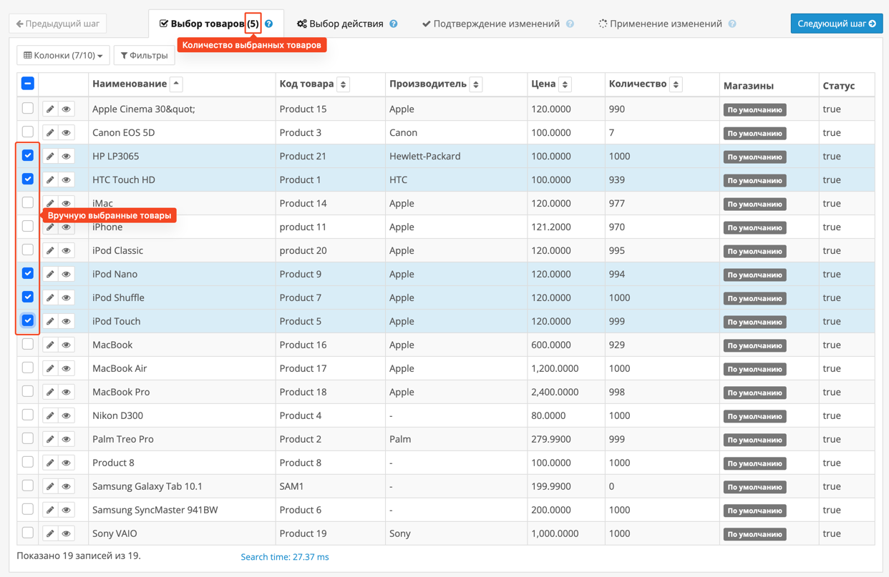
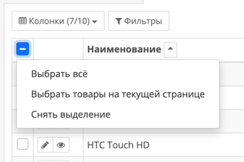

# Выбор товаров

После фильтрации вы можете легко выбрать те товары, с которыми хотите провести пакетные действия.

Модуль **Bulk Products** предоставляет интуитивно понятный интерфейс для выделения нужных позиций.

---

## Способы выбора товаров

В таблице с результатами поиска рядом с каждым товаром отображается чекбокс.  
Вы можете:

- Выделить товары вручную — один или несколько.
- Использовать выпадающее меню в заголовке таблицы для массовых действий.

{width=80%}
/// caption
Выделение товаров вручную
///

Массовые действия:

- **Выбрать всё** — выделяет **все товары**, включая те, что не помещаются на текущей странице.
- **Выбрать товары на текущей странице** — выделяет только те, что видимы сейчас.
- **Снять выделение** — сбрасывает весь выбор.

/// caption
Опции выбора товаров
///

---

## Почему это удобно

- ✅ Выбор конкретных позиций без необходимости повторного поиска.
- ✅ Массовое выделение за один клик.
- ✅ Поддержка как постраничного выбора, так и выбора всех результатов.
- ✅ Состояние выбора сохраняется между шагами.

Это делает процесс пакетного управления товарами **максимально простым и прозрачным** — даже при большом объёме данных.  
Интерфейс спроектирован так, чтобы вы могли быстро видеть, какие товары выбраны, и при необходимости скорректировать выбор.