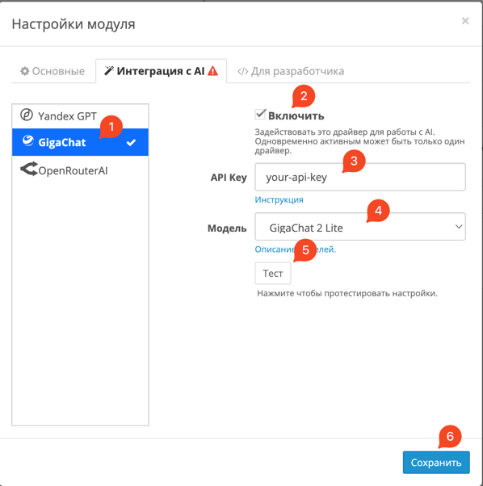
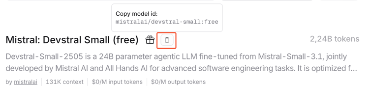

# Настройки модуля

Модуль **Bulk Products** предлагает гибкую систему настроек, разделённую на три вкладки:

- [Основные](#основные)
- [Интеграция с AI](#интеграция-с-ai)
- [Для разработчика](#для-разработчика)

---

## Основные

### Размер пакета обработки товаров

Эта опция определяет, сколько товаров будет обрабатываться за один шаг при массовом редактировании.

!!! info "Значение по умолчанию"
    50 товаров за шаг.

- Слишком большое значение может замедлить выполнение операций или перегрузить сервер.
- Слишком маленькое значение увеличивает общее время обработки.

Рекомендуется подбирать значение в зависимости от производительности сервера и объёма редактируемых данных.

---

## Интеграция с AI

Модуль поддерживает интеграцию с несколькими AI-провайдерами для автоматической генерации описаний, SEO-текста и других полей.

### Как включить AI-функции

1. Выберите провайдера из списка.
2. Нажмите **«Включить»**.
3. Введите **API-ключ** и другие настройки.
4. Нажмите **«Сохранить»**.

!!! note "Важно"
    Хотя бы один провайдер должен быть активирован, чтобы использовать AI-функции.

---

### Yandex GPT

Российская языковая модель от Яндекса. Отлично работает с русским языком, стабильна и проста в настройке.

**Как подключить:**

1. Получите API-ключ: [инструкция](https://yandex.cloud/ru/docs/iam/concepts/authorization/api-key)
2. Выберите модель: [доступные модели](https://yandex.cloud/ru/docs/foundation-models/concepts/yandexgpt/models#generation)
3. Ознакомьтесь с руководством: [гайд по промптам](https://yandex.cloud/ru/docs/foundation-models/gpt-prompting-guide/about)
4. Используйте готовые примеры: [библиотека промптов](https://yandex.cloud/ru/docs/foundation-models/prompts/yandexgpt/)

---

### GigaChat

AI от Сбера. Хорошо понимает контекст, ориентирован на русскоязычную аудиторию, поддерживает сложные сценарии генерации текста.

**Как подключить:**

1. Получите токен: [инструкция](https://developers.sber.ru/docs/ru/gigachat/individuals-quickstart#shag-2-poluchenie-tokena-dostupa)
2. Ознакомьтесь с моделями: [список моделей](https://developers.sber.ru/docs/ru/gigachat/models)
3. Изучите промпт-инжиниринг: [гайд](https://developers.sber.ru/docs/ru/gigachat/prompts-hub/prompt-engineering)
4. Примеры промптов: [библиотека](https://developers.sber.ru/docs/ru/gigachat/prompts-hub/overview)

---

### OpenRouter AI

Платформа для подключения популярных моделей: ChatGPT, Claude, Gemini и другие.

**Как подключить:**

1. Зарегистрируйтесь: [регистрация](https://openrouter.ai/sign-up)
2. Получите API-ключ: [создание ключа](https://openrouter.ai/settings/keys)
3. Выберите модель: [список моделей](https://openrouter.ai/models?order=pricing-low-to-high)

!!! tip "Преимущества"
    - Поддержка множества моделей  
    - Бесплатные опции  
    - Гибкость и простота

!!! warning "Недостатки"
    Возможна нестабильность отдельных моделей, особенно при бесплатном использовании.

---

## Для разработчика

### Режим разработчика

Включает расширенный вывод отладочной информации, полезный при диагностике.

!!! warning "Внимание"
    Не рекомендуется включать на рабочем магазине.

---

### Переустановить модуль

Полностью сбрасывает настройки и возвращает модуль к исходному состоянию.

!!! danger "Осторожно"
    Все пользовательские параметры будут удалены. Операция необратима.
